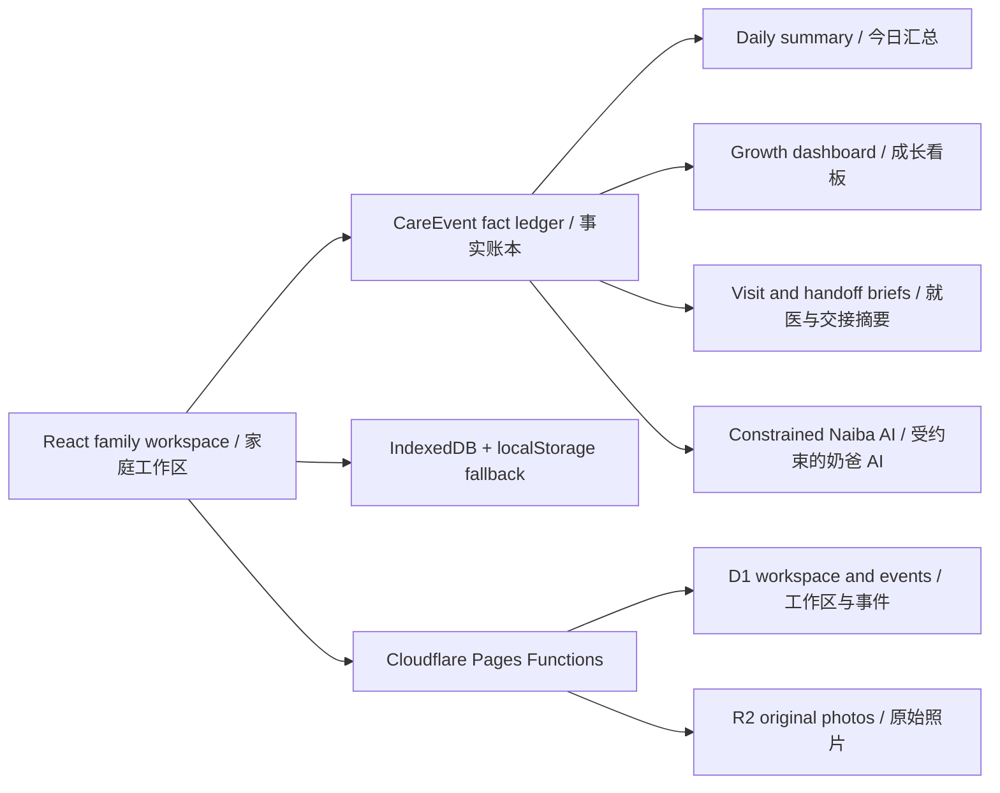

# BabyForge

[中文](./README.md) | English

[](https://babyforge.pages.dev) [](https://react.dev/) [](https://vite.dev/) [](https://developers.cloudflare.com/pages/)


A growth and care workspace for families in mainland China with children from birth to age six. BabyForge brings “what matters today, what happened, how things change over time, and which facts to take to a professional” into one shared family workspace. Important conclusions come from structured facts and deterministic rules first; AI only explains and assists within explicit boundaries.

Live demo: [babyforge.pages.dev](https://babyforge.pages.dev)

> [!IMPORTANT]
> BabyForge is a baby growth and care workspace. It does not provide diagnoses, health scores, automated triage, prescriptions, or medication dosage advice. Confirm vaccination plans, unusual signs, and health concerns with a vaccination clinic or qualified professional.

## Quick start

```powershell
npm ci
npm run dev
```

Open the local URL printed by Vite. Local development includes demo login accounts and does not require D1, R2, or a model provider:

- Administrator: `niwa` / `niwaniwa`
- Read-only guest: `baby` / `0729`

## Current capabilities

| Workspace | What is available |
| --- | --- |
| Today | Shows the current baby plus daily feeding, sleep, diaper, and medication summaries; keeps the family album in the center and daily actions in the right rail; summary cards open that day's facts or the matching record form. |
| Records | Records breastfeeding, bottle feeding, sleep, diapers, medication, temperature, temperature observations, and growth measurements; filters the fact timeline by date and type; supports details, corrections, and permanent voiding while retaining version history and recorder identity. |
| Growth | Combines a birth-to-six roadmap, latest weight/length (height)/head-circumference measurements, personal changes, deterministic summaries, and parent actions in one continuous dashboard; the main chart shows P3/P50/P97, while the full chart provides seven percentile references, point details, and an equivalent data table. |
| Health | Brings together the birth-to-six roadmap based on China's 2026 national immunization schedule, common pediatric topics, educational cases, and 3D organ teaching with a 2D fallback. |
| Experience | Searches Chinese source articles by the baby's age across recommended, feeding, care, sleep, and health-observation categories; the first release covers 0–36 months and includes source labels, caching, refresh controls, and safe external links. |
| Naiba AI | Available globally with authorized baby context and care facts; answers stage questions, explains growth changes, prepares visit or caregiver handoff briefs, and turns natural-language notes into fact drafts that must be reviewed before saving. |

The interface switches between Chinese and English. Family roles include administrators, caregivers who can record, and read-only guests; write permissions are enforced in both the UI and API.

## Three core workflows

### 1. Low-friction recording

Complete facts such as breastfeeding and diapers can be saved in one step. Bottle feeding, sleep, medication, temperature, and growth measurements use lightweight forms with only the necessary fields. Saved events enter one `CareEvent` fact timeline, where they can be corrected or voided without physical deletion.

### 2. Explainable growth

The growth workspace separates valid facts from national-standard comparability. Raw measurements and personal changes remain visible when profile data is incomplete or the measurement falls outside a standard's scope; conflicting same-day values are never silently resolved. Birth measurements reference `WS/T 800—2022`, while post-birth completed-month references use `WS/T 423—2022`.

### 3. Constrained AI assistance

Naiba AI supports services compatible with OpenAI Responses, OpenAI Chat Completions, and Anthropic Messages. The server recomputes deterministic results and applies guardrails. Missing facts are not silently filled in, confirmed danger signals interrupt ordinary conversation, and AI-generated record drafts require explicit user review and confirmation before entering the fact timeline.

## Data and deployment



- Local development stores baby profiles, care events, plans, and concerns in IndexedDB with `localStorage` as a fallback; the album remains in the current browser.
- Cloudflare deployment uses Pages, Pages Functions, D1, and private R2 to synchronize family workspaces, members, events, and photos.
- Care events use online-first writes. Network failures preserve the current input for manual retry instead of creating a background offline queue; server-side `version` checks expose conflicts rather than overwriting silently.
- “Clear local data” only clears the current device and does not remove cloud records. The cloud album stores original files and does not currently strip EXIF automatically.
- Experience search sends only a server-generated age band and category to Tavily, never the baby's name, ID, exact birth date, family account, or care records.

## Configuration and deployment

See the [Cloudflare deployment guide](./docs/cloudflare-deploy.md) for:

- D1 migrations, R2 bindings, and Pages deployment;
- Naiba AI model, base URL, protocol, and secrets;
- Tavily configuration for Experience search;
- administrator, caregiver, and guest permission checks.

Keep secrets in `.dev.vars`, `.env.local`, or platform Secrets. Never place them in source code, `wrangler.jsonc`, or commit history.

## Verification

```powershell
npm test
npm run lint
npm run build
npm run test:visual
```

Unit tests cover the fact protocol, recording workspace, growth standards, age policy, Experience search, AI skills, model protocols, and guardrails. Playwright covers key desktop and mobile flows.

## Project documents

- Product boundaries and context: [PRODUCT.md](./PRODUCT.md) · [CONTEXT.md](./CONTEXT.md)
- MVP and content specification: [docs/mvp-spec.md](./docs/mvp-spec.md) · [docs/pediatric-bilingual-spec.md](./docs/pediatric-bilingual-spec.md)
- Latest capability designs: [recording workspace](./docs/issue-28-recording-workspace-design.md) · [Growth V2](./docs/issue-40-growth-v2-design.md) · [Today and global navigation](./docs/issue-39-today-navigation-design.md)
- Long-term vision and research: [docs/vision.md](./docs/vision.md) · [docs/prd.md](./docs/prd.md) · [docs/research/parenting-app-moat.md](./docs/research/parenting-app-moat.md)
