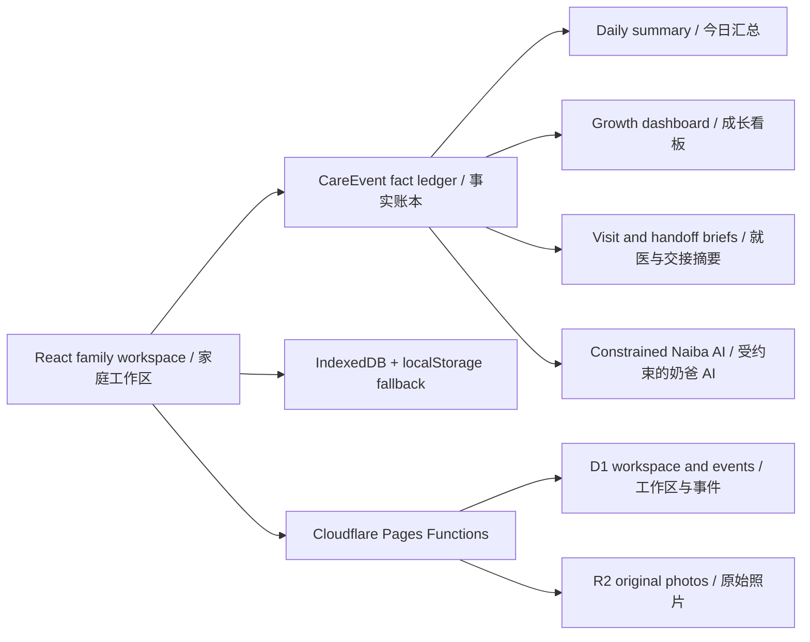

# BabyForge

中文 | [English](./README.en.md)

面向中国大陆家庭的 0–6 岁宝宝成长与照护工作台。BabyForge 把「今天看什么、发生了什么、长期怎样变化、何时带什么事实去咨询专业人员」放进同一个家庭工作区；所有重要结论优先来自结构化事实和确定性规则，AI 只在明确边界内解释与协助记录。

在线体验：[babyforge.pages.dev](https://babyforge.pages.dev)

> [!IMPORTANT]
> BabyForge 是研究型教育原型，不提供诊断、健康评分、自动就医分级、处方或药物剂量建议。疫苗安排、异常表现和健康问题请以接种门诊及专业人员意见为准。

## 快速开始

```powershell
npm ci
npm run dev
```

打开终端显示的本地地址。Vite 开发环境内置演示登录，不需要配置 D1、R2 或模型服务：

- 管理员：`niwa` / `niwaniwa`
- 只读游客：`baby` / `0729`

## 当前能力

| 工作区 | 已落地能力 |
| --- | --- |
| 今天 | 围绕当前宝宝展示喂养、睡眠、尿布、用药四项当日汇总；中间保留家庭相册，右侧集中每日事项；汇总卡可进入当天事实或直接打开对应记录表单。 |
| 记录 | 统一记录亲喂、瓶喂、睡眠、尿布、用药、体温、体温观察和成长测量；按日期与类型查看事实时间线，并支持详情、纠正和永久作废，保留版本历史与记录人。 |
| 成长 | 连续看板整合 0–6 岁成长路标、体重/身长（身高）/头围最近测量、个人变化、确定性摘要和父母事项；主图展示 P3/P50/P97，完整曲线提供七条百分位参考线、点详情和等价数据表。 |
| 健康 | 统一收纳 2026 年版国家免疫规划的 0–6 岁疫苗路标、常见儿科主题、教育病例，以及带 2D 降级的器官 3D 教学。 |
| 经验 | 按宝宝月龄在推荐、喂养、护理、睡眠、健康观察五类中检索中文原文；首版覆盖 0–36 个月，提供来源标识、缓存、刷新和安全外链。 |
| 奶爸 AI | 作为全局入口读取已授权的宝宝背景与照护事实，回答阶段问题、解释成长变化、整理就医或照护交接摘要，并把自然语言记录转换为“核对后保存”的事实草稿。 |

界面可在中文与 English 间切换。家庭角色分为管理员、可录入照护者和只读游客；写入权限同时在前端与 API 校验。

## 三条核心工作流

### 1. 低压力记录

亲喂和尿布等完整事实可一步保存；瓶喂、睡眠、用药、体温和成长测量使用只包含必要字段的轻表单。保存后的事件进入同一条 `CareEvent` 事实时间线，可纠正或作废，不做物理删除。

### 2. 可解释成长

成长页把有效事实与国家标准可比较性分开：即使资料不足或超出标准范围，原始测量和个人变化仍可查看；同一指标同日冲突不会被静默择一。出生测量参考 `WS/T 800—2022`，出生后整月参考使用 `WS/T 423—2022`。

### 3. 受约束的 AI 协助

奶爸 AI 支持 OpenAI Responses、OpenAI Chat Completions 和 Anthropic Messages 兼容服务。服务端重新计算确定性结果并执行 guardrails；缺失事实不会自动补全，确认危险信号时会中断普通对话，AI 生成的记录草稿必须经用户核对确认后才能进入事实时间线。

## 数据与部署



- 本地开发默认把宝宝档案、照护事件、计划和关注事项保存在 IndexedDB，`localStorage` 作为降级副本；相册保存在当前浏览器。
- Cloudflare 部署使用 Pages、Pages Functions、D1 和私有 R2，同步家庭工作区、成员、事件与照片。
- 照护事件在线优先写入。网络失败时保留当前输入供手动重试，不建立后台离线队列；服务端通过 `version` 暴露冲突，避免静默覆盖。
- “清除本地数据”只清除当前设备数据，不删除云端记录。云端相册保存原始文件，目前不会自动移除 EXIF。
- 经验检索只向 Tavily 发送服务端生成的适龄段与分类，不发送宝宝姓名、ID、精确生日、家庭账号或照护记录。

## 配置与部署

完整步骤见 [Cloudflare 部署文档](./docs/cloudflare-deploy.md)，包括：

- D1 migration、R2 binding 与 Pages 部署；
- 奶爸 AI 的模型、Base URL、协议和 Secret；
- Tavily 经验检索配置；
- 管理员、照护者、游客权限验证。

密钥只应放在 `.dev.vars`、`.env.local` 或平台 Secret 中，不要写入源码、`wrangler.jsonc` 或提交记录。

## 验证

```powershell
npm test
npm run lint
npm run build
npm run test:visual
```

单元测试覆盖事实协议、记录工作台、成长标准、年龄策略、经验检索、AI skills、模型协议和 guardrails；Playwright 覆盖桌面与移动端主路径。

## 项目资料

- 产品边界与上下文：[PRODUCT.md](./PRODUCT.md) · [CONTEXT.md](./CONTEXT.md)
- MVP 与内容规范：[docs/mvp-spec.md](./docs/mvp-spec.md) · [docs/pediatric-bilingual-spec.md](./docs/pediatric-bilingual-spec.md)
- 最新能力设计：[记录工作台](./docs/issue-28-recording-workspace-design.md) · [成长 V2](./docs/issue-40-growth-v2-design.md) · [Today 与全局导航](./docs/issue-39-today-navigation-design.md)
- 长期愿景与研究：[docs/vision.md](./docs/vision.md) · [docs/prd.md](./docs/prd.md) · [docs/research/parenting-app-moat.md](./docs/research/parenting-app-moat.md)

## 来源与许可

前端交互骨架参考并移植自 [3DCellForge](https://github.com/huangserva/3DCellForge) 提交 `df56957`。BabyForge 保留自身 Git 历史，并已移除细胞领域、在线模型生成 provider 和原项目服务端代码。

项目采用 [MIT License](./LICENSE)，第三方许可见 [THIRD_PARTY_NOTICES.md](./THIRD_PARTY_NOTICES.md)。
