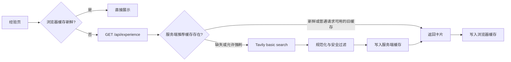

# Issue #27 「经验」整体设计

状态：已讨论确认，待实现  
Issue：https://github.com/ttttstc/BabyForge/issues/27

## 1. 交付目标

新增一级入口「经验」，按宝宝当前年龄为 0～36 个月家庭搜索中文育儿原文，并以轻量卡片展示。首版优先保证搜索闭环可用，不建设内容平台，也不引入复杂推荐系统。

成功闭环：

> 读取宝宝生日 → 计算内容适龄段 → 按当前分类查询 Tavily → 安全过滤与整理 → 展示、缓存、打开或复制原文链接

## 2. 已确认边界

- 经验搜索覆盖出生至 36 个月。
- 内容适龄段独立于现有 0～28 天照护阶段，不修改 `getStage()` 的既有契约。
- 五个分类为：推荐、喂养、护理、睡眠、健康观察。
- 首次只加载「推荐」；其他分类按首次访问懒加载。
- 「更新文章」只刷新当前分类。
- 8 篇是推荐首屏的正常目标，安全规则优先，不为凑数降低门槛。
- 首版只搜索中文原文；英文界面提示推荐内容目前来自中文来源。
- 所有登录角色可查看；管理员和月嫂可强制刷新，游客不能强制刷新。
- 支持打开原文和复制源链接。
- 浏览器与服务端均可短期缓存推荐卡片，但不缓存第三方完整正文或 HTML。
- 首版使用 Tavily，不做多供应商自动切换，也不串联第二个模型。
- 外部服务容量按约 100 日活、每月不超过 50 美元控制。

## 3. 领域模型

### 内容适龄段

内容适龄段只用于构造搜索上下文和标注推荐项，不是发育判断或医疗结论。

| ID | 展示范围 |
| --- | --- |
| `newborn` | 0～28 天 |
| `young-infant` | 29 天～2 个月 |
| `early-infant` | 3～5 个月 |
| `solid-food-start` | 6～8 个月 |
| `mobile-explorer` | 9～11 个月 |
| `early-toddler` | 12～17 个月 |
| `rapid-development` | 18～23 个月 |
| `autonomy` | 24～29 个月 |
| `young-toddler` | 30～36 个月 |

出生后前 28 天按本地日历日计算；此后按完整日历月计算，避免用 30 天近似一个月。36 月龄包含完整月龄为 36 的期间，37 月龄起返回当前未覆盖。

服务端以 `Asia/Shanghai` 的当前日历日期计算，测试允许注入当前日期。未来出生日期和缺失生日均返回明确错误。

### 经验推荐项

经验推荐项是指向第三方原文的链接卡片，不是 BabyForge 经审核的知识内容。最小字段：

```ts
interface ExperienceRecommendation {
  id: string
  title: string
  summary: string
  sourceName: string
  sourceDomain: string
  sourceType: 'professional' | 'experience'
  publishedAt?: string
  url: string
  category: 'recommended' | 'feeding' | 'care' | 'sleep' | 'health'
  ageBandId: string
  ageLabel: string
}
```

`publishedAt` 无法可靠获取时省略，不推测日期。可信专业来源使用注册表中的规范机构名；其他来源使用站点名或域名，不让模型自行认证机构身份。

### 可信专业来源

代码内维护一份小型来源注册表，包含规范域名、机构名、来源类型、允许的风险级别、启用状态和最后核验日期。黄疸、发热、呼吸异常、抽搐、用药、急救、异常发育和疾病判断等主题，只允许可信专业来源。

普通护理和家长经验可以使用其他公开来源，但必须标为「经验来源」，并通过广告、危险建议和年龄错配过滤。

## 4. 页面与导航

- 新增路由 `#/experience` 和 `ExperienceView`。
- 桌面端加入现有顶部主导航，不引入第二套底部导航。
- 移动端主导航改为单行横向滚动轨道；触控高度至少 44px，当前项与键盘焦点自动滚入视野，两端以轻微渐隐提示仍可滚动。
- 验证宽度：320、375、390、430px，确保全部入口可滑到并点击。

页面结构：

1. 标题、宝宝当前年龄、内容适龄段、最近更新时间和当前分类刷新按钮。
2. 五分类切换栏。
3. 推荐卡片列表。
4. 首次加载、缓存、缓存过期、刷新失败、结果不足和无结果状态。

卡片包含标题、最多两句话摘要、来源类型、机构或域名、适龄范围、可得时的发布时间、复制源链接和查看原文。

「查看原文」以新标签页直接打开，并使用 `noopener noreferrer`；不增加确认弹窗。「复制源链接」复制去除常见追踪参数后的规范化 HTTPS URL，并给出可访问的成功反馈。页面不展示第三方图片，避免热链、版权和加载稳定性问题。

## 5. 数据流



请求只把服务端生成的中文内容适龄段和分类查询发给 Tavily。宝宝姓名、宝宝 ID、精确生日、家庭账号和照护记录均不离开 BabyForge。

显示年龄可以精确到日或月；搜索查询只使用共享的内容适龄段，以提高缓存命中率并减少对外信息。

## 6. Tavily 首版接入

每个分类一次 Tavily Search 调用，使用服务端 Secret `TAVILY_API_KEY`：

```json
{
  "topic": "general",
  "search_depth": "basic",
  "auto_parameters": false,
  "include_answer": false,
  "include_raw_content": "text",
  "max_results": 12,
  "country": "china"
}
```

- `basic` 固定消耗 1 credit，避免自动升级为 2 credits。
- `results[].content` 是每个 URL 的 NLP 摘要，首版清理并限制为一至两句话后直接用于卡片。
- `raw_content` 只在当前请求内用于危险词、广告和年龄错配检查，处理后立即丢弃，不写入日志或缓存。
- 健康观察查询使用可信专业来源域名作为 `include_domains`；其他分类使用统一 `exclude_domains` 和结果后置过滤。
- 首版不调用 Tavily Extract/Crawl/Research，也不调用第二个大模型。

上线前只做轻量冒烟：当前宝宝五个分类各一条查询，再补一个较大月龄查询；若中文结果无法形成基本列表，再调整查询词或 Tavily 参数，不启动供应商横评项目。

## 7. 过滤与排序

过滤顺序保持确定且可测试：

1. URL 仅允许公开 HTTP(S)，规范化并删除常见追踪参数。
2. 按规范 URL 去重；标题高度相似的结果保留来源质量更高者。
3. 丢弃低相关度、目标年龄明显冲突和非中文结果。
4. 丢弃商品推广、课程、奶粉、保健品、偏方、自行用药、剂量和明显危险建议。
5. 高风险健康主题必须命中可信专业来源注册表。
6. 同一来源最多连续出现一项，并限制同域名总数。

排序权重依次为：年龄匹配、来源等级、分类相关性、Tavily relevance score、可得时的新近度和来源多样性。

如果只有 5 项通过，就返回 5 项并显示数量说明；过滤器不会为了达到 8 项回填被拒结果。

## 8. API 契约

```http
GET /api/experience?babyId={babyId}&category={category}&refresh=0|1
```

处理步骤：

1. 校验登录会话、`babyId` 访问权限和分类枚举。
2. 从 D1 宝宝档案读取生日并计算显示年龄与内容适龄段。
3. 游客传 `refresh=1` 返回 `403`；管理员和月嫂允许强刷，但同一缓存键设置最短刷新间隔。
4. 查询服务端缓存；未命中时才调用 Tavily。
5. 返回整理后的卡片，不返回 Tavily 原始响应或原始正文。

建议响应：

```json
{
  "ageText": "9天",
  "ageBand": { "id": "newborn", "label": "新生儿期", "rangeLabel": "0～28天" },
  "category": "feeding",
  "generatedAt": "2026-08-07T08:25:00+08:00",
  "expiresAt": "2026-08-08T08:25:00+08:00",
  "cacheState": "generated",
  "articles": []
}
```

错误使用现有 JSON 错误风格：`400` 参数错误、`401` 未登录、`403` 无权访问或游客强刷、`422` 出生日期缺失/非法/未来、`429` 刷新过频/预算关闭、`502` Tavily 连接或响应失败、`503` 服务未配置、`504` Tavily 查询超时。

## 9. 缓存与成本控制

### 浏览器缓存

键：

```text
babyforge:experience:v1:{babyId}:{contentLanguage}:{ageBandId}:{category}
```

缓存只保存响应卡片、生成时间、过期时间和规则版本。24 小时内直接展示且不请求 API；超过 24 小时仍可作为带时间标识的旧结果，最长保留 7 天。强刷成功后只覆盖当前分类。

### 服务端缓存

使用 Cloudflare Pages Functions 可用的 Cache API，不新增 D1 表。内部键只包含：

```text
experience:v1:zh-CN:{ageBandId}:{category}:{rulesVersion}
```

缓存新鲜期 24 小时、故障兜底最长 7 天，只保存派生卡片。Cache API 按数据中心保存而非全球复制，这是首版为减少复杂度接受的限制。

### 费用保护

- 查询词、分类和年龄段均由服务端枚举，客户端不能提交任意查询。
- 默认使用缓存，分类懒加载，不预取。
- 游客不能强刷；管理员和月嫂对同一键设置刷新冷却。
- Tavily 后台配置月度额度告警与硬上限；达到上限后返回缓存或明确的暂不可更新状态。
- 日志只记录适龄段、分类、结果数量、通过数量、耗时、credit 数和错误码，不记录生日或原文内容。

## 10. 关键验收场景

1. **年龄与隐私**：边界日/月能映射到正确内容适龄段；对 Tavily 的请求不包含宝宝姓名、ID 或生日。
2. **安全优先**：未知站点的高风险健康内容被拒；可信医院内容可进入列表；不足 8 项时不回填危险结果。
3. **缓存与刷新**：24 小时内返回页面或切换 Tab 不重复搜索；管理员只刷新当前分类；游客强刷被拒；联网失败显示旧缓存；缓存写入失败不阻塞当前响应。
4. **外链能力**：卡片能复制规范化源链接并在新标签页安全打开；缺失发布时间时不显示伪日期。
5. **移动可达性**：在 320～430px 宽度下，新增经验入口及其他一级入口均能横向滑到、聚焦并点击。
6. **边界响应**：37 月龄以上返回 `available: false` 的明确未覆盖状态；未来或非法生日返回 `422`；Tavily 超时返回 `504`，且不阻塞页面。

## 11. 明确非目标

- 不建设文章详情页、正文数据库、运营后台、收藏、评论、社区或用户画像。
- 不缓存第三方完整正文、HTML 或图片。
- 不开放自定义搜索词。
- 不做英文文章来源。
- 不做复杂评分模型、多供应商容灾或后台定时爬取。
- 不修改现有 0～28 天照护阶段、照护事件或知识内容契约。

## 12. 实施顺序与停止点

1. 实现内容适龄段、来源注册表、URL/过滤规则及单元测试。
2. 实现 Tavily 适配和 `/api/experience`，使用固定响应测试缓存、权限和失败路径。
3. 实现经验页、浏览器缓存、复制/外链和移动导航可达性。
4. 配置 Tavily Secret，执行六条左右真实中文查询冒烟和目标视觉测试。

正式编码前的唯一外部停止点：确认 Tavily 条款允许把派生推荐卡片缓存最多 7 天，并提供可用的 `TAVILY_API_KEY`。如果只允许更短时间，缓存期限以合同为准，架构不变。
