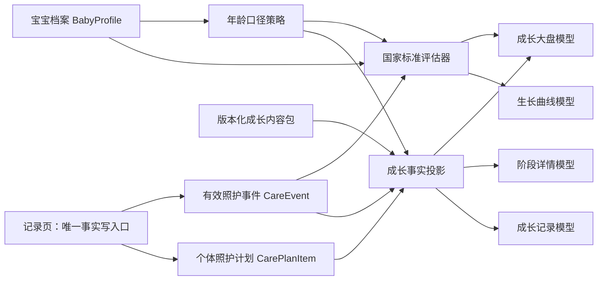

# Issue #29 成长页整体方案

状态：方案定稿；Slice 1–3 已实现，待后续内容与迁移增强

## 唯一目标

把现有独立“阶段”入口重建为统一“成长”入口，让家长在一个页面内查看宝宝当前阶段、个人生长轨迹、阶段参考和成长历程，同时继续以统一照护事件作为事实来源。

## 已确认决定

### 交付边界

- 底层年龄、阶段、观察和状态协议覆盖 0～6 岁，不写死为新生儿模型。
- 首个完整体验纵向切片覆盖出生后 0～28 天。
- 新成长页一次建立基础大盘，以及生长曲线、阶段详情和成长记录三个下钻入口。
- 28 天以上暂时复用现有阶段摘要与已有记录能力，不承诺未经建设和审核的完整阶段指南内容。
- 标准参考、百分位、Z 分数和数据质量结论只有在确定性能力满足适用条件时展示；数据不足时明确停止计算。

### 单一事实写入口

- 成长页是只读的查看、理解与回顾界面，不直接新增、修改、纠正或作废宝宝事实。
- 测量、活动尝试、发展观察、体检、牙齿及其他成长事件统一在记录页写入。
- 成长页的相关操作跳转记录页并预选记录类型；保存或取消后可返回成长页原来的页内位置。
- 页签、筛选、曲线选中点、内容折叠和浏览位置属于临时界面状态，可以留在成长页，不进入事实账本。
- 现有阶段页直接勾选里程碑的能力不迁入新成长页。

### 领域概念拆分

- 阶段参考是适龄通用知识，不是当前宝宝的完成清单。
- 推荐活动是可选择尝试的审核知识，不是必须完成的照护计划。
- 照护计划项是父母或其他照护者未来应该处理的事项，可以完成。
- 发展观察是家长在具体时间实际看到的宝宝表现，属于照护事件事实，但不等同于标准化筛查。
- 活动尝试记录某项推荐活动及宝宝当时的反应，不设置成功或失败。
- 现有 `milestoneRecords` 中的任务型数据归入照护计划完成记录，不迁成宝宝发展能力。
- “成长里程碑”只可作为面向用户的回顾性文案，不作为底层含混状态。

### 页面产品重心

- 成长 Tab 首先提供当前基础信息大盘，而不是活动打卡或复杂成长档案。
- 核心内容依次是：当前年龄与阶段、阶段基本介绍、宝宝各项数值及参考位置、本阶段父母行动、本阶段宝宝发展建议。
- 成长历程、活动尝试和其他回顾能力属于辅助能力，首期范围保持克制。

### 大盘为主的信息架构

- 成长 Tab 根页面是当前基础信息大盘，不采用“概览 / 曲线 / 阶段 / 历程”四个同权重页签。
- 大盘按顺序展示：年龄与阶段、最近成长数值及国家标准参考位置、宝宝自己的近期变化、父母本阶段要做、宝宝本阶段发展重点、少量数据缺失或核对提示。
- 大盘提供“完整生长曲线”“当前阶段详情”“全部成长记录”三个详情入口，均最多一次点击到达。
- 成长历程是辅助详情，不占据一级页内导航。
- 推荐活动、活动尝试和照片等低频内容进入阶段详情或成长记录详情，不挤占大盘首屏。
- 桌面端与移动端使用相同的信息优先级；移动端按该顺序单列展开。

### 成长大盘范围

- 大盘只承载成长领域信息：宝宝身份与年龄口径、当前阶段、最近成长测量、国家标准参考位置、个人近期变化、父母阶段行动、宝宝发展重点及成长数据提示。
- 今日喂养、睡眠、尿布和用药汇总留在今天页，不在成长大盘重复。
- 症状、疾病和当前健康问题留在健康相关页面。
- 完整疫苗状态留在疫苗能力中；成长大盘中的父母行动最多提供对应核对或跳转入口。
- 相册、AI 建议、天气、家庭成员管理和全量照护时间线不属于成长大盘。

### 国家标准比较口径

- “同龄比较”只表示宝宝测量在适用国家标准人群中的参考位置，不使用 BabyForge 用户数据排名。
- 出生时评价使用适用的 `WS/T 800—2022`；该标准适用于胎龄 24～42 周单胎新生儿的出生时体格生长评价。
- 出生后的 7 岁以下儿童生长参考使用适用的 `WS/T 423—2022`。
- 每次正式比较必须保留输入测量、性别、年龄口径、标准编号、标准版本和计算时间。
- 标准不适用、必要资料缺失或测量质量不足时停止正式比较，并说明限制。
- 国家标准参考位置不是产品用户排名，也不能脱离连续轨迹直接包装成诊断。

### 大盘标准结果

- 大盘测量主卡展示最近有效值、日期与来源、国家标准生长水平及对应百分位区间。
- 生长水平严格使用国家标准的“上 / 中上 / 中 / 中下 / 下”，不改写成优秀、落后或产品评分。
- 大盘同时展示宝宝相对上次有效测量的差值和时间间隔，国家标准位置不能替代个人连续变化。
- 首期大盘不直接展示低体重、生长迟缓、消瘦、超重或肥胖等营养状况名称。
- 出生时评价使用 WS/T 800 的独立结果，不与出生后 WS/T 423 生长水平混为同一评价。
- 国家标准不可用时，只展示宝宝数值、来源和可确定的个人变化。

### 国家标准生长曲线

- 完整生长曲线详情必须绘制适用国家标准提供的儿童生长参考曲线，并叠加宝宝自己的有效测量点与连线。
- 首期指标包括年龄别体重、年龄别身长/身高和适用年龄内的年龄别头围。
- 标准参考曲线与宝宝个人轨迹必须在视觉和图例上明确区分。
- 完整绘制 P3、P10、P25、P50、P75、P90、P97 七条国家标准百分位曲线；P3、P50、P97 相对突出，其余曲线弱化。
- 宝宝个人轨迹使用最高视觉优先级，不能被标准背景淹没。
- 国家标准离散年龄锚点之间可以连线用于图表展示，但正式评价不得根据可视化插值产生伪精确百分位。
- 标准曲线锚点详情展示适用年龄、标准值、标准编号和版本。
- 0～28 天宝宝默认查看 0～3 月龄的标准曲线范围；宝宝轨迹只画到当前日期，未来标准背景不表达为宝宝预测。
- WS/T 800 出生评价以独立出生标记或说明呈现，不与出生后的月龄标准曲线强行连接。

### 父母行动与宝宝发展

- “父母本阶段要做”使用照护计划项表达，例如儿保预约、疫苗核对、安全检查和补充测量。
- 父母行动可以有适用时间窗口和完成状态；正式完成记录仍统一从记录页写入。
- “宝宝本阶段发展重点”描述某个年龄范围可能逐渐出现的动作、语言、认知与互动变化，不设置必须完成、截止日或通过状态。
- 存在发展观察事实时可以显示“家长曾观察到”；不存在事实时只显示“尚未记录”，不得显示“宝宝未完成”。
- 推荐活动表达为父母可以给宝宝提供的体验机会，不作为给宝宝派发的任务。
- 多项持续担忧进入儿保咨询或健康支持路径，不由发展重点列表自动生成异常结论。

### 分模块年龄口径

- 足月宝宝只展示实际年龄，不显示无意义的矫正年龄字段。
- 早产且胎龄资料完整、仍在适用期限内时，页面头部同时展示实际年龄和矫正年龄，并说明哪些内容使用矫正年龄。
- 阶段介绍、宝宝发展重点和推荐活动由审核规则选择正确年龄口径；适用时使用矫正年龄。
- 出生时国家标准评价按胎龄使用 WS/T 800；出生后评价由对应标准规则独立选择正确年龄口径。
- 父母事项按实际日期、实际年龄或专业人员指定日期执行，不因发展参考采用矫正年龄而自动顺延。
- 缺少有效胎龄时不推算矫正年龄，也不生成依赖该年龄口径的正式结果。
- 用户可以查看年龄口径说明，但不能通过任意切换年龄口径改变正式评价。

官方来源：

- [国家卫生健康委《不同胎龄新生儿出生时生长评价标准》（WS/T 800—2022）](https://www.nhc.gov.cn/wjw/c100311/202208/07787ef64ba34fe1bc8bbdae9fd0d4e5.shtml)
- [国家卫生健康委《7 岁以下儿童生长标准》（WS/T 423—2022）](https://www.nhc.gov.cn/wjw/c100311/202211/923e7646561d4b88b72da9097d4da4d5.shtml)
- [国家卫生健康委《早产儿保健工作规范》](https://www.nhc.gov.cn/fys/c100078/201703/bd1c0e0d58644bf3b234150cdf5cb4ca.shtml)
- [国家卫生健康委《婴幼儿早期发展服务指南（试行）》](https://www.nhc.gov.cn/wjw/c100378/202502/658e7e4eb5024746b13186ac0f97a27b.shtml)

## 当前代码基线

- 当前一级导航只有“阶段”，没有独立“成长”入口；现有路由为 `#/stage/newborn`。
- `StageDashboard` 当前混合了承诺式里程碑、日历、简单成长柱状图和日期详情。
- 成长测量已经通过 `CareEvent` 保存，并投影到兼容的 `growthMeasurements` 读模型。
- 年龄口径、WS/T 标准选择与部分确定性评估能力已经存在，但尚未组成 Issue #29 所描述的统一成长体验。

### 必须纠正的实现差距

1. `baby.growthAgeBasis` 当前是用户可编辑字段，测量表单直接复制该值；正式评价应改为按用途自动选择年龄口径，用户只能查看说明。
2. `StageDashboard` 的“里程碑”实际主要是准备资料、回顾记录等照护任务，不能迁成宝宝发展能力。
3. 当前成长图是最近八次测量的柱状图，没有国家标准曲线、标准锚点、可访问数据表或完整点详情。
4. 当前 `BabyStateSnapshot.stage` 只按实际日龄选择阶段，尚未支持分用途年龄口径和内容包版本。
5. 当前统一事件协议只校验核心字段，成长、发展观察和活动尝试仍需要各自的 payload 校验器。
6. 当前统一跳转没有记录类型和返回地址契约，无法从成长页下钻到预选记录流程并返回原位置。
7. 当前通用 25% 跳变规则不区分指标、月龄、间隔和测量方式，不能直接作为面向家长的数据质量结论。

## 总体架构

成长能力由事实、确定性计算、审核内容和派生页面模型四层组成：



### 不建立第二份成长状态

- 不新增需要同步、迁移或手工维护的持久化 `GrowthState`。
- `BabyProfile`、有效 `CareEvent` 和已有 `CarePlanItem` 是个体事实来源。
- 国家标准结果由相同输入和标准版本确定性重算。
- 阶段介绍与建议来自版本化内容包。
- 页面只保存路由、筛选、折叠和选中点等界面状态。
- 该决定由 [ADR-0007](./adr/0007-growth-dashboard-read-model.md) 记录。

## 领域模型

| 概念 | 含义 | 持久化来源 | 是否可在成长页修改 |
| --- | --- | --- | --- |
| 宝宝档案 | 出生日期、胎龄、性别等稳定背景 | `BabyProfile` | 否 |
| 成长测量 | 体重、身长/身高、头围的客观记录 | `CareEvent(kind=measurement, category=growth_measurement)` | 否 |
| 发展观察 | 家长实际观察到的发展表现 | `CareEvent(category=development_observation)` | 否 |
| 活动尝试 | 某次活动及宝宝当时反应 | `CareEvent(category=activity_attempt)` | 否 |
| 父母行动定义 | 某阶段可执行的通用行动 | 成长内容包 | 否 |
| 个体照护计划 | 针对当前宝宝的具体未来事项 | `CarePlanItem` | 否 |
| 行动完成事实 | 某项父母行动已完成或已核对 | `CareEvent(category=care_action)` | 否 |
| 阶段参考 | 当前年龄范围的通用说明 | 成长内容包 | 否 |
| 国家标准评估 | 测量在适用国家标准中的位置 | 确定性派生结果，可缓存但可重算 | 否 |
| 页面模型 | 大盘、曲线、阶段详情和记录列表 | 运行时派生 | 否 |

### 成长测量 payload

首期保留现有 `type` 字段以避免无价值迁移，同时收紧校验：

```ts
interface GrowthMeasurementPayload {
  type: 'weight' | 'length' | 'headCircumference'
  value: number
  unit: 'kg' | 'cm'
  source:
    | 'birth_record'
    | 'clinical'
    | 'caregiver_observation'
    | 'standardized_screening'
  method?: string
  note?: string
}
```

- 发生日期统一读取 `CareEvent.occurredAt`，不再以 payload 内重复日期作为事实权威值。
- `ageBasis` 不由表单写入；评估器根据用途、胎龄、测量日期和标准适用范围选择。
- 旧 payload 中的 `measuredAt` 与 `ageBasis` 在兼容期只读，不再决定新的正式结果。
- `CareEvent.source` 表示记录进入系统的渠道；payload 的 `source` 表示测量事实的医学来源场景。两者必须分别展示和追溯，不能互相猜测。

### 发展观察 payload

```ts
interface DevelopmentObservationPayload {
  domain:
    | 'gross_motor'
    | 'fine_motor'
    | 'language'
    | 'cognition'
    | 'social_emotional'
    | 'self_care'
  signalId: string
  observation: string
  context?: string
  relatedContentUnitId?: string
}
```

- 它只表达家长看到的事实，不提供通过、失败或落后字段。
- `standardized_screening` 和 `professional_conclusion` 必须使用不同 kind/source，不能伪装成家长观察。

### 活动尝试 payload

```ts
interface ActivityAttemptPayload {
  activityId: string
  response: 'comfortable' | 'neutral' | 'not_adapted' | 'stopped'
  durationMinutes?: number
  note?: string
}
```

- 首期不要求建设该记录表单；它属于 #28 的记录能力扩展。
- 成长页不显示成功率、连续打卡或完成分数。

### 国家标准评估结果

```ts
interface GrowthStandardEvaluation {
  inputEventIds: string[]
  metric: 'weight' | 'length' | 'headCircumference'
  ageBasis: 'chronological' | 'corrected' | 'postmenstrual'
  ageValue: number | null
  standardPackageId: 'ws-t-800-2022' | 'ws-t-423-2022' | null
  standardVersion: string | null
  percentileBand?:
    | 'below-p3'
    | 'p3-p10'
    | 'p10-p25'
    | 'p25-p50'
    | 'p50-p75'
    | 'p75-p90'
    | 'p90-p97'
    | 'p97-plus'
  growthLevel?: 'lower' | 'lower_middle' | 'middle' | 'upper_middle' | 'upper'
  birthSizeCategory?: 'small' | 'appropriate' | 'large'
  dataQuality: 'sufficient' | 'limited' | 'insufficient'
  limitations: string[]
  evaluatedAt: string
}
```

- `growthLevel` 严格映射 WS/T 423 的“下 / 中下 / 中 / 中上 / 上”。
- 首期不输出营养状况名称。
- 只有数值恰好等于官方锚点或标准提供可复现公式时才可输出精确百分位或 Z 分数；不能从曲线像素或普通线性插值生成伪精确值。
- 评估结果可以按输入事件、档案版本和标准版本缓存，但缓存不是事实源；档案或有效事件发生纠正时必须失效并确定性重算。

## 年龄口径策略

建立单一 `resolveAgeContext(purpose, baby, at)` 纯函数，不再从用户偏好读取正式年龄口径：

| 用途 | 年龄口径 |
| --- | --- |
| 页面身份头部 | 始终显示实际年龄；适用时附加矫正年龄 |
| 阶段介绍与宝宝发展重点 | 足月使用实际年龄；符合规则的早产儿使用矫正年龄 |
| WS/T 800 出生评价 | 使用出生胎龄，仅适用于出生时记录和标准适用人群 |
| WS/T 423 出生后评价 | 由审核通过的标准选择规则决定；不接受用户强制覆盖 |
| 父母行动和预约 | 使用真实日期、实际年龄或专业人员指定时间 |

实施时：

- 移除记录页“年龄口径”可编辑下拉框。
- 旧 `baby.growthAgeBasis` 字段保留一个兼容周期，但不再是正式评估输入。
- 每个正式评估和内容模块都显示自己采用的年龄口径及限制。
- 年龄规则无法确定时失败关闭，只展示原始事实。

## 国家标准计算链

### 输入门

正式评价前依次验证：

1. 测量事件为当前有效版本，未作废、未被纠正替代；
2. 宝宝、测量日期、性别和标准所需胎龄资料完整；
3. 指标、单位、数值格式和发生时间有效；
4. 出生记录与出生日期匹配；
5. 标准包、指标、年龄、性别、胎龄和单双胎适用范围匹配；
6. 对冲突或可疑记录只展示事实，不生成正式参考位置。

### 标准选择

- 出生时、胎龄 24～42 周、单胎且资料完整：使用 WS/T 800—2022。
- 出生后的 7 岁以下适用测量：使用 WS/T 423—2022。
- 头围只在 WS/T 423 提供的适用年龄范围内评价。
- 多胎出生、标准范围外或资料不足：返回 `insufficient` 和具体限制，不回退到错误标准。

### 生长水平映射

WS/T 423 的百分位区间映射为：

| 百分位位置 | 大盘生长水平 |
| --- | --- |
| `< P3` | 下 |
| `P3 ≤ x < P25` | 中下 |
| `P25 ≤ x < P75` | 中 |
| `P75 ≤ x < P97` | 中上 |
| `≥ P97` | 上 |

大盘同时保留更细的 P3/P10/P25/P50/P75/P90/P97 区间，供用户理解具体位置；不改写为优秀、落后、正常或异常。

### 个人变化

- 只比较同一指标、相同单位、有效版本且时间顺序明确的相邻记录。
- 展示差值和间隔，不凭两个点生成长期趋势结论。
- 至少两个有效点才显示连线；至少三个具有合理时间覆盖的点才允许显示“个人轨迹可供观察”。
- 不使用当前通用的“数值变化超过 25%”作为跨指标统一判断；跳变规则必须按指标、月龄、间隔和测量方法提供经过验证的独立规则，否则只提示核对录入值和方法。

## 国家标准曲线模型

```ts
interface GrowthChartModel {
  metric: 'weight' | 'length' | 'headCircumference'
  ageBasis: 'chronological' | 'corrected'
  range: { fromAge: number; toAge: number; unit: 'day' | 'month' }
  referenceSeries: Array<{
    percentile: 3 | 10 | 25 | 50 | 75 | 90 | 97
    points: Array<{ age: number; value: number; official: true }>
  }>
  babyPoints: Array<{
    eventId: string
    age: number
    value: number
    occurredAt: string
    source: string
    method?: string
    quality: 'valid' | 'verify'
  }>
  standard: { id: string; version: string; sourceUrl: string }
  limitations: string[]
}
```

### 绘制规则

- 使用 React 原生 SVG 实现首期曲线，不为三种固定指标引入新的大型图表依赖。
- 绘制全部七条国家标准百分位线，突出 P3/P50/P97，弱化其余线。
- 宝宝轨迹使用最明显颜色和点型；标准线不使用宝宝轨迹颜色。
- 标准离散锚点连线只用于阅读，不参与正式评价计算。
- 移动端点击点打开底部详情；桌面端悬停预览、点击锁定。
- 提供与图表等价的可访问数据表；核心值不能只依赖悬停读取。
- 数据少于两个有效点时只画散点，不连伪趋势。
- 0～28 天默认显示 0～3 月龄标准背景，宝宝数据只画到今天。

## 版本化成长内容包

阶段内容沿用 ADR-0006 的版本化知识包和来源准入原则，但使用结构化成长内容，不直接依赖自由文本搜索结果。

```ts
interface GrowthContentPack {
  id: string
  version: string
  releaseStatus: 'draft' | 'approved' | 'retired'
  stages: GrowthStageContent[]
  sources: SourceReference[]
}

interface GrowthStageContent {
  id: string
  ageWindow: { basis: 'chronological' | 'corrected'; minDays: number; maxDays: number }
  title: string
  summary: string
  parentActions: ParentActionDefinition[]
  developmentHighlights: DevelopmentHighlight[]
  recommendedActivities: RecommendedActivity[]
  sourceIds: string[]
}
```

### 内容责任

- `approved` 是项目发布流水线的内部内容状态，不要求家庭用户或产品所有者逐条医学审批。
- 内容来源、结构化、交叉核对和版本冻结由内容发布流程负责。
- 用户只看到已发布内容及来源说明，不承担判断来源权威性的责任。
- AI 不在运行时生成、改写或补全年龄阶段结论。
- 内容包缺失时显示“该阶段内容尚未发布”，不挪用相邻年龄内容。

### 首期内容范围

- 完整提供 0～7 天与 8～28 天两个阶段的标题、简介、父母行动和宝宝发展重点。
- 主要来源包括国家卫生健康委《婴幼儿早期发展服务指南（试行）》和现有审核知识包中的新生儿资料。
- 28 天以上只保证阶段协议和兼容摘要；未经结构化发布的建议不进入新成长页。
- 推荐活动保留少量高价值内容，不建设活动库、连续打卡或训练计划。

## 页面模型与体验

### 成长大盘 `#/growth`

桌面端建议结构：

```text
┌──────────────────────────────────────────────────────────────┐
│ 小恩 · 实际年龄 18 天              当前阶段：新生儿适应期    │
│ 阶段一句话介绍                          [了解当前阶段]         │
├──────────────────────────────────────────────────────────────┤
│ 体重卡                    身长卡                    头围卡     │
│ 最新值 / 日期 / 来源       最新值 / 日期 / 来源       ...      │
│ 国家标准水平与区间         国家标准水平与区间                  │
│ 与上次差值                 与上次差值                          │
├──────────────────────────────────────────────────────────────┤
│ 宝宝自己的近期变化                         [完整生长曲线]      │
├──────────────────────────────┬───────────────────────────────┤
│ 父母本阶段要做               │ 宝宝本阶段发展重点              │
│ 具体行动、时间窗口、状态      │ 范围参考、已观察到/尚未记录     │
├──────────────────────────────┴───────────────────────────────┤
│ 少量数据提示                          [全部成长记录]           │
└──────────────────────────────────────────────────────────────┘
```

移动端顺序固定为：阶段头部 → 三项测量 → 近期变化 → 父母行动 → 宝宝发展重点 → 数据提示 → 三个详情入口。

### 测量卡状态

- 有有效记录且可评价：值、时间、来源、生长水平、百分位区间、个人差值。
- 有有效记录但不可评价：值、时间、来源、限制原因；不显示空的参考等级。
- 无记录：明确“暂无记录”，跳转记录页并预选对应指标。
- 存在冲突或可疑值：保留原始值并显示“需核对记录”，跳转记录详情；不自动选一个值。
- 记录过旧：只有阶段内容包或专业计划给出明确复测时间时才提示，不使用无来源的统一天数。

### 阶段详情 `#/growth/stage`

首期只包含：

1. 当前阶段概述；
2. 年龄口径说明；
3. 父母本阶段要做；
4. 宝宝本阶段发展重点；
5. 少量推荐互动；
6. 适合在儿保时确认的事项；
7. 来源与内容版本。

允许查看上一阶段和下一阶段，但未来阶段只用于了解，不能改变宝宝当前阶段或正式评价。

### 生长曲线 `#/growth/chart`

- 指标切换：体重、身长/身高、头围。
- 新生儿默认范围：0～3 月；后续按年龄提供 1 月、3 月、6 月、全部等有意义范围。
- 点详情包含日期、年龄、数值、来源、方法、记录人、与上次差值和数据限制。
- 页面底部固定显示标准编号、版本、年龄口径、计算时间和官方来源。

### 成长记录 `#/growth/history`

首期只聚合与成长核心直接相关的记录：

- 成长测量；
- 发展观察；
- 与成长相关的体检或专业结论；
- 牙齿记录；
- 父母阶段行动完成事实。

活动尝试、照片和视频不进入首期默认列表；待记录协议和真实需求稳定后再扩展。成长页只提供查看和跳转编辑，编辑、纠正、作废仍在记录页完成。

## 路由与深链

### 新路由

| 路由 | 页面 |
| --- | --- |
| `#/growth` | 成长大盘 |
| `#/growth/chart?metric=weight&range=0-3m` | 国家标准生长曲线 |
| `#/growth/stage?stage=current` | 当前阶段详情 |
| `#/growth/history?type=all` | 成长记录 |

### 旧路由映射

- `#/stage/newborn`、`#/stage`、`#/months` → `#/growth/stage?stage=current`
- 能识别的旧阶段 ID 映射到 `#/growth/stage?stage=<id>`。
- 无法识别的旧深链进入当前阶段，并显示一次性“阶段内容已合并到成长页”提示。
- 路由解析需要保留查询参数；当前简单地剥离 `?` 的实现需要升级。

### 记录页跳转契约

```text
#/records?type=growth_measurement&metric=weight&returnTo=<encoded-growth-url>
#/records?type=development_observation&signal=<id>&returnTo=<encoded-growth-url>
#/records?type=care_action&action=<id>&returnTo=<encoded-growth-url>
```

- `returnTo` 只接受应用内允许路由，防止开放重定向。
- 保存成功或取消后返回来源页及原来的查询状态。
- #29 只建立跳转契约；缺失的记录表单由 #28 实现，不在成长页复制。

### 其他入口联动

- 今天页只保留当前阶段、最近可靠测量和“查看成长”轻量入口，统一指向 `#/growth`；不在 #29 中重构今天页布局。
- 当前 `LeftRail` 和其他“阶段”链接统一改为成长大盘或阶段详情，不再打开独立阶段工作台。
- 一级导航只把现有“阶段”更名为“成长”，不借 #29 新增或重排健康、疫苗、家庭等其他一级入口。

## 数据迁移

### 原则

- 不物理删除事实，不改写旧事件 ID，不复制测量事件。
- 迁移可重复执行；相同输入必须产生相同结果。
- 新版本先兼容读取旧结构，确认投影一致后再停止写旧集合。

### 具体映射

1. `growthMeasurements`：以现有 `CareEvent(category=growth_measurement)` 为权威；仅对尚未存在对应事件的旧记录补建一次事件。
2. `milestoneRecords`：按照定义 ID 映射为父母照护行动完成事实或现有 `CarePlanItem` 状态；不得迁为发展观察。
3. `adminTaskRecords` 与 `taskLogs`：继续按照护行动处理，不混入宝宝发展重点。
4. `baby.growthAgeBasis`：保留兼容读取，移除用户编辑入口；新正式评价改用年龄策略函数。
5. 已纠正和已作废事件：只投影当前有效链；旧版本仍可在记录历史中追溯。
6. 页面浏览状态：旧阶段路由通过别名跳转，不迁为宝宝事实。

### 兼容期

- 本地存储升级到下一版本时保留旧数组，使用事件投影生成新页面。
- 服务端现有 `growth_age_basis` 字段暂不做破坏性删除；一轮兼容发布后再单独评估 schema 清理。
- 旧 `StageDashboard` 在新成长页验收通过前保留代码但不作为主导航入口；确认无回滚需要后再单独清理。

## Issue 边界与依赖

### #29 负责

- 成长主导航、四个只读页面模型和页面；
- 国家标准曲线；
- 年龄策略、标准评估结果展示和数据质量降级；
- 阶段内容包的读取与 0～28 天首期内容；
- 旧阶段路由和旧里程碑语义迁移；
- 跳转记录页的深链契约。

### #28 负责

- 成长测量、发展观察、父母行动完成、牙齿和体检等事实表单；
- 新增、纠正、作废、失败重试和版本冲突体验；
- 保存后按 `returnTo` 返回成长页。

### 不并入 #29

- 重构今天页；
- 建设完整疫苗或健康中心；
- 营养状况诊断标签；
- AI 成长判断；
- 活动打卡系统、相册或月报；
- 一次性制作 0～6 岁全部阶段内容。

## 实施切片

### Slice 1：领域与迁移地基

- 实现年龄口径策略，停止用户覆盖正式年龄；
- 定义成长 payload 校验器和内容包 schema；
- 建立 `buildGrowthDashboardModel`、`buildGrowthChartModel` 等纯函数；
- 增加旧里程碑语义迁移与路由别名；
- 以单元测试锁定投影和标准选择。

停止点：不改主导航，纯模型和迁移测试全部通过。

### Slice 2：成长大盘

- 新增 `#/growth`；
- 完成阶段头部、三项测量卡、个人变化、父母行动、宝宝发展重点和数据提示；
- 主导航“阶段”更名为“成长”；
- 记录 CTA 使用安全 `returnTo` 契约。

停止点：0～28 天主路径可独立验收，成长页没有任何事实写入。

### Slice 3：国家标准曲线

- 构建七条标准序列和宝宝点序列；
- 实现响应式 SVG、点详情、图例和可访问数据表；
- 实现指标、范围和年龄口径说明；
- 将 WS/T 800 出生结果作为独立标记呈现。

停止点：官方 fixture、边界数据和移动端可读性通过。

### Slice 4：阶段详情与成长记录

- 接入 0～7 天、8～28 天结构化内容；
- 实现阶段浏览和来源版本；
- 聚合首期成长记录类型；
- 完成旧深链迁移提示。

停止点：四个页面、路由、空状态和回流闭环全部验收。

## 验收矩阵

### 核心主路径

1. 足月 18 天宝宝进入成长页，10 秒内看见阶段、三项最近测量和国家标准位置。
2. 点击体重卡进入国家标准曲线，看到七条参考线和宝宝个人点。
3. 点击“记录体重”进入记录页预选体重，保存后返回原成长页面并刷新。
4. 父母行动显示可执行状态；宝宝发展重点没有完成、失败或截止日。

### 国家标准与年龄

5. 出生时单胎、胎龄和性别完整，使用 WS/T 800；出生后记录不误用该标准。
6. 出生后适用记录使用 WS/T 423，并正确映射“上 / 中上 / 中 / 中下 / 下”。
7. 多胎出生、胎龄缺失、性别缺失或超出适用范围时停止正式评价并显示限制。
8. 早产儿在适用时显示实际年龄和矫正年龄；阶段内容、标准评价和父母事项分别使用正确口径。
9. 用户不能通过设置项强制改变正式评价年龄。

### 事实一致性

10. 已作废记录不进入大盘和曲线。
11. 被纠正记录只使用当前有效版本，历史链仍可追溯。
12. 同日冲突记录不静默择一，页面提示核对。
13. 一个有效点不连线，两个点只显示差值，不生成长期趋势结论。
14. 旧 `milestoneRecords` 只迁为父母行动，不生成虚假的宝宝发展观察。

### 内容与降级

15. 0～7 天和 8～28 天内容显示来源和内容包版本。
16. 28 天以上没有发布内容时只显示兼容阶段摘要，不挪用新生儿建议。
17. 内容包或标准包不可用时，原始测量和个人变化仍可查看。
18. 家庭用户不会看到内容审核操作，也不承担 `approved` 判断责任。

### 响应式与无障碍

19. 移动端无需精细拖拽即可读出当前点数值。
20. 图表具有等价数据表、键盘焦点和非颜色图例。
21. 桌面端悬停预览、点击锁定；移动端点击打开底部详情。
22. 所有错误文案描述数据或能力限制，不把系统错误表达为宝宝异常。

## 代码落点建议

- `src/domain/agePolicy.js`：分用途年龄口径。
- `src/domain/growth.js`：保留确定性标准评估，补充正式生长水平并移除用户覆盖。
- `src/domain/growthDashboard.js`：四个派生页面模型。
- `src/content/growthStages.js`：版本化结构化阶段内容。
- `src/features/GrowthDashboard.jsx`：成长大盘。
- `src/features/GrowthChartView.jsx`：国家标准曲线。
- `src/features/GrowthStageView.jsx`：阶段详情。
- `src/features/GrowthHistoryView.jsx`：成长记录。
- `src/app/router.js`、`src/features/Header.jsx`、`src/features/Workspace.jsx`：新路由与旧路由映射。
- `src/features/RecordCenter.jsx`：仅按 #28 增加预选和返回契约，不在 #29 内复制表单。

## 发布前检查

- 目标单元测试、类型/静态检查和相关视觉测试通过；
- 国家标准 fixture 与官方表格逐项复核；
- 全量构建通过；
- diff 审查确认没有在成长页增加事实写入；
- 旧路由和旧数据迁移在真实浏览器存储副本上验证；
- 桌面和移动端使用真实曲线数据验证，而不是只验证 mock 空状态。
